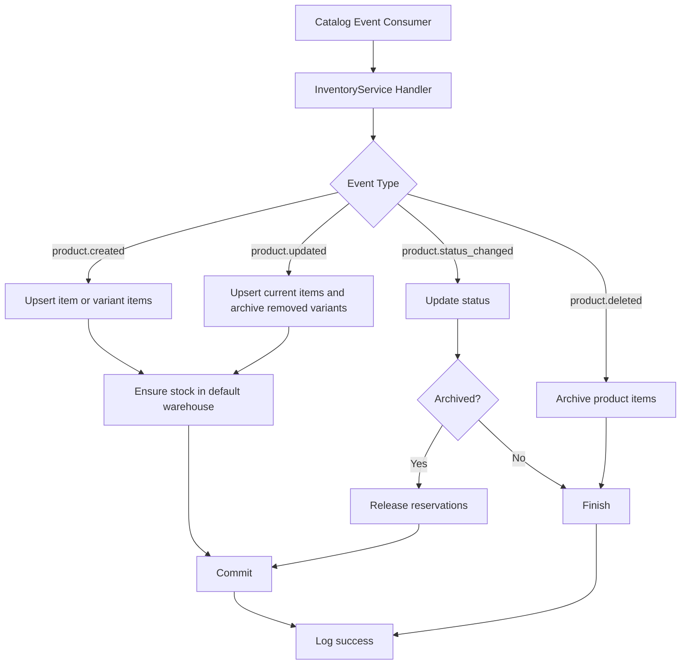
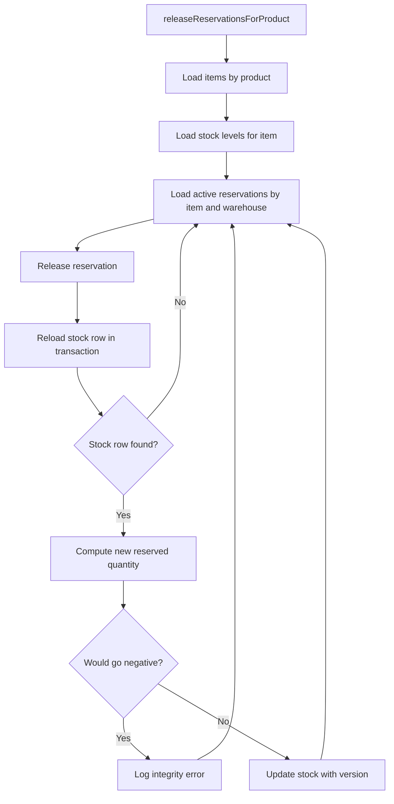

# Inventory Service Flows

This document summarizes the execution flow in `internal/service/inventory_service.go`.

Source file:

- `services/inventory/internal/service/inventory_service.go`

## Overview

`InventoryService` is the orchestration layer between callers or event consumers and the repository layer.

Its responsibilities in this file are:

- read inventory items, stock levels, and warehouses
- update inventory item metadata
- synchronize inventory state from catalog events
- release reservations when a product is archived
- enforce warehouse rules such as single-default behavior and deactivation constraints

## Main Dependencies

- `inventoryRepo`: inventory item queries, writes, and transaction entrypoint
- `stockRepo`: stock level creation and updates
- `warehouseRepo`: warehouse lookup and default-warehouse rules
- `reservationRepo`: reservation lookup and release
- `eventPublisher`: injected but not used in this file

## Read Flows

### GetItem

Flow:

1. Caller invokes `GetItem(ctx, id)`.
2. Service delegates to `inventoryRepo.GetWithStock(ctx, id)`.
3. Repository loads the inventory item with stock data.
4. Result returns to caller.

### GetItemBySKU

Flow:

1. Caller invokes `GetItemBySKU(ctx, sku)`.
2. Service delegates to `inventoryRepo.GetBySKU(ctx, sku)`.
3. Result returns to caller.

### ListItems

Flow:

1. Caller invokes `ListItems(ctx, filter)`.
2. Service delegates to `inventoryRepo.List(ctx, filter)`.
3. Repository returns matching items plus total count.
4. Result returns to caller.

### GetItemStockLevels

Flow:

1. Caller invokes `GetItemStockLevels(ctx, id)`.
2. Service first verifies that the inventory item exists through `inventoryRepo.GetByID(ctx, id)`.
3. If the item does not exist, the error returns immediately.
4. If the item exists, service loads stock levels through `stockRepo.GetByItemID(ctx, id)`.
5. Result returns to caller.

## Update Flow

### UpdateItem

Flow:

1. Caller invokes `UpdateItem(ctx, id, input)`.
2. Service updates the inventory item through `inventoryRepo.Update(ctx, id, input)`.
3. If neither reorder field is present, service returns the updated item.
4. If `ReorderPoint` or `ReorderQuantity` is present, service computes concrete values for both.
5. Service calls `stockRepo.UpdateReorderSettings(ctx, id, rp, rq)`.
6. Updated item returns to caller.

Notes:

- The item record is updated first.
- Reorder settings are then propagated to stock rows.
- Partial reorder updates depend on repository semantics because missing values are converted to `0` before calling the stock repository.

## Catalog Event Flows

These handlers are typically called by an event consumer that receives catalog events.

### HandleProductCreated

Purpose:

- create inventory records for a new catalog product
- ensure stock rows exist in the default warehouse

Flow:

1. Load the default warehouse through `warehouseRepo.GetDefault(ctx)`.
2. Begin a transaction through `inventoryRepo.BeginTx(ctx)`.
3. Register deferred rollback.
4. Check whether `payload.Variants` is empty.
5. If there are no variants:
   - build one product-level `InventoryItem`
   - upsert it with `inventoryRepo.Upsert(ctx, tx, item)`
   - if a default warehouse exists, create or update its stock row with `stockRepo.UpsertWithTx(ctx, tx, created.ID, defaultWH.ID)`
6. If variants exist:
   - loop over each variant
   - build one `InventoryItem` per variant
   - upsert each item
   - ensure a stock row exists in the default warehouse for each item
7. Commit the transaction.
8. Log success with `slog.Info`.

Outcome:

- simple products produce one inventory item
- variant products produce one inventory item per variant
- each created item gets stock initialized in the default warehouse when one exists

### HandleProductUpdated

Purpose:

- reconcile inventory state to match the latest catalog product shape

Flow:

1. Begin a transaction.
2. Register deferred rollback.
3. Load the default warehouse.
4. Check whether `payload.Variants` is empty.
5. If there are no variants:
   - build one product-level `InventoryItem`
   - upsert it
   - ensure a stock row exists in the default warehouse
6. If variants exist:
   - loop through each incoming variant
   - build one `InventoryItem` per variant
   - upsert each variant item
   - ensure a stock row exists in the default warehouse for each variant item
7. Load all existing inventory items for the product through `inventoryRepo.GetByProductID(ctx, payload.ProductID)`.
8. Build a set of variant IDs present in the incoming payload.
9. Compare existing inventory items against that set.
10. For each existing variant item that no longer exists in the payload:
    - build an archived copy of that item
    - upsert it with status `archived`
11. Commit the transaction.
12. Log success.

Outcome:

- current variants stay active or are created
- removed variants are archived
- stock rows remain present in the default warehouse for active items

### HandleProductStatusChanged

Purpose:

- propagate catalog product status into inventory
- release reservations when a product is archived

Flow:

1. Map catalog-facing statuses to inventory statuses.
2. Normalize the incoming `payload.NewStatus`.
3. Update all inventory items for the product through `inventoryRepo.UpdateStatus(ctx, payload.ProductID, newStatus)`.
4. If `newStatus` is not `archived`, stop and log success.
5. If `newStatus` is `archived`:
   - begin a transaction
   - register deferred rollback
   - call `releaseReservationsForProduct(ctx, tx, payload.ProductID)`
   - commit the transaction
6. Log success.

Outcome:

- inventory status follows catalog status
- archiving also frees reserved stock

### HandleProductDeleted

Purpose:

- soft-delete product inventory state by archiving it

Flow:

1. Call `inventoryRepo.UpdateStatus(ctx, payload.ProductID, "archived")`.
2. Log success.

Outcome:

- product inventory is archived rather than physically deleted

## Reservation Cleanup Flow

### releaseReservationsForProduct

Purpose:

- release all active reservations for all inventory items belonging to a product
- reduce reserved quantities on the associated stock rows

Flow:

1. Load all inventory items for the product with `inventoryRepo.GetByProductID(ctx, productID)`.
2. For each item, load all stock levels with `stockRepo.GetByItemID(ctx, item.ID)`.
3. For each stock level, load active reservations with `reservationRepo.GetActiveByItemAndWarehouse(ctx, item.ID, level.WarehouseID)`.
4. For each reservation:
   - release it using `reservationRepo.Release(ctx, tx, res.ID)`
   - reload the stock row inside the transaction with `stockRepo.GetByItemAndWarehouseTx(ctx, tx, item.ID, level.WarehouseID)`
   - if the stock row cannot be loaded, continue to the next reservation
   - compute `newReserved = sl.QuantityReserved - res.Quantity`
   - if `newReserved < 0`, log a data integrity error and continue
   - otherwise update the stock row with `stockRepo.UpdateQuantityWithVersion(ctx, tx, sl.ID, sl.QuantityOnHand, newReserved, sl.Version)`
5. Return success after all items, stock levels, and reservations are processed.

Notes:

- this helper expects the caller to provide an open transaction
- stock updates use versioned writes, which suggests optimistic concurrency control
- the helper tolerates some stock-row lookup problems by continuing instead of failing the full release pass

## Warehouse Flows

### CreateWarehouse

Flow:

1. Begin a warehouse transaction.
2. Register deferred rollback.
3. If the incoming warehouse should be default, clear existing defaults through `warehouseRepo.ClearAllDefaults(ctx, tx)`.
4. Create the warehouse through `warehouseRepo.Create(ctx, tx, input)`.
5. Commit the transaction.
6. Return the new warehouse.

Outcome:

- a new default warehouse replaces any existing default atomically

### UpdateWarehouse

Flow:

1. Check whether `input.IsDefault` is present and true.
2. If so:
   - begin a transaction
   - register deferred rollback
   - switch the default warehouse atomically through `warehouseRepo.SetDefaultAtomic(ctx, tx, id)`
   - commit the transaction
3. Call `warehouseRepo.Update(ctx, id, input)`.
4. Return the updated warehouse.

Outcome:

- default-warehouse switching is protected by a transaction
- regular warehouse field updates still happen through the repository update call

### DeactivateWarehouse

Flow:

1. Load the warehouse through `warehouseRepo.GetByID(ctx, id)`.
2. If it is the default warehouse, return a `ConflictError`.
3. Check whether it still has stock through `warehouseRepo.HasStock(ctx, id)`.
4. If it still has stock, return a `ConflictError`.
5. Otherwise call `warehouseRepo.Deactivate(ctx, id)`.

Outcome:

- the default warehouse cannot be deactivated
- a warehouse with stock cannot be deactivated until stock is transferred out

### ListWarehouses

Flow:

1. Caller invokes `ListWarehouses(ctx)`.
2. Service delegates to `warehouseRepo.List(ctx)`.
3. Result returns to caller.

### GetWarehouse

Flow:

1. Caller invokes `GetWarehouse(ctx, id)`.
2. Service delegates to `warehouseRepo.GetByID(ctx, id)`.
3. Result returns to caller.

## Service-Level Data Flow

### Read Request Flow

```text
Caller
  -> InventoryService read method
  -> inventoryRepo / stockRepo / warehouseRepo
  -> database
  -> result back to caller
```

### Item Update Flow

```text
Caller
  -> UpdateItem
  -> inventoryRepo.Update
  -> optional stockRepo.UpdateReorderSettings
  -> database
  -> updated item back to caller
```

### Catalog Event Sync Flow

```text
Catalog event consumer
  -> InventoryService event handler
  -> begin transaction when needed
  -> inventoryRepo / stockRepo / warehouseRepo / reservationRepo
  -> database writes
  -> commit
  -> structured log entry
```

### Warehouse Management Flow

```text
Caller
  -> InventoryService warehouse method
  -> warehouseRepo
  -> database
  -> warehouse result or conflict error
```

## Mermaid Diagrams

### Catalog Sync Flow



### Reservation Release Flow



## Key Design Notes

- This service is primarily an orchestration layer.
- Repositories own persistence details.
- Transactions are used around multi-step state transitions.
- Product deletion is modeled as archiving, not hard deletion.
- Reservation cleanup is a special rule triggered when a product becomes archived.
